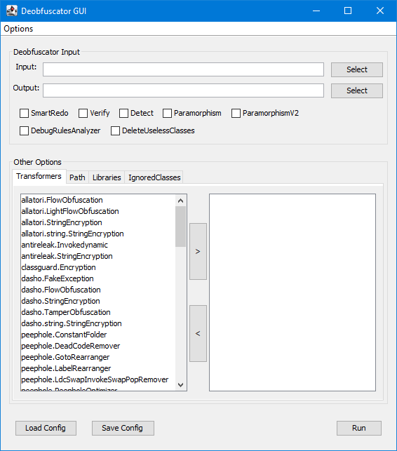

# deobfuscator-gui 

A GUI for a the popular [java-deobfuscator](https://github.com/java-deobfuscator/deobfuscator).

## What is Deobfuscator-GUI?
Deobfuscator-GUI is a GUI for the command line deobfuscator. User interfaces are more intuitive to the average user, allowing more people to use the tool without needing to concern themselves with syntax or configuration files.

## How to Use 
1. Download the deobfuscator.jar from https://github.com/java-deobfuscator/deobfuscator.
2. Download or build the GUI:
    * Download: [releases](https://github.com/java-deobfuscator/deobfuscator-gui/releases/latest)
    * Build: Clone the repository then run `mvn package`
3. Run the GUI:
    * Specify an input and output file, and then add the required libraries and select your transformers.

## Screenshots

