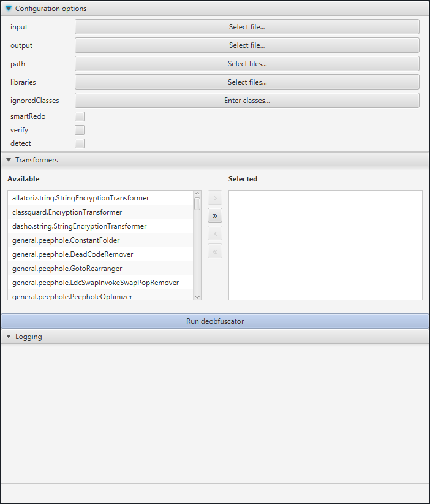

# deobfuscator-gui 

A GUI for a the popular [java-deobfuscator](https://github.com/java-deobfuscator/deobfuscator).

## What is Deobfuscator-GUI?
Deobfuscator-GUI is a GUI for the command line deobfuscator. User interfaces are more intuitive to the average user, allowing more people to use the tool without needing to concern themselves with syntax or configuration files.

There are two variants in the repository, one for *Swing* and another for *JavaFX (default)*. 

## How to Use 
1. Download the deobfuscator.jar from https://github.com/java-deobfuscator/deobfuscator.
2. Download or build the GUI:
    * Download: [releases](https://github.com/java-deobfuscator/deobfuscator-gui/releases/latest)
    * Build: Clone the repository then run `mvn package`
3. Run the GUI for either varient:
    * JavaFX: Select the `input` and `output` fields, select your transformers from the list, then click `run deobfuscator`
        * If `detect` is selected, `output` is not required. This mode will suggest transformers given some obfuscated `input`
    * Swing: Follow the instructions in the UI
        * Execute with `java -cp deobfuscator-gui.jar io.github.thistestuser.DeobfuscatorFrame`

## Screenshots

